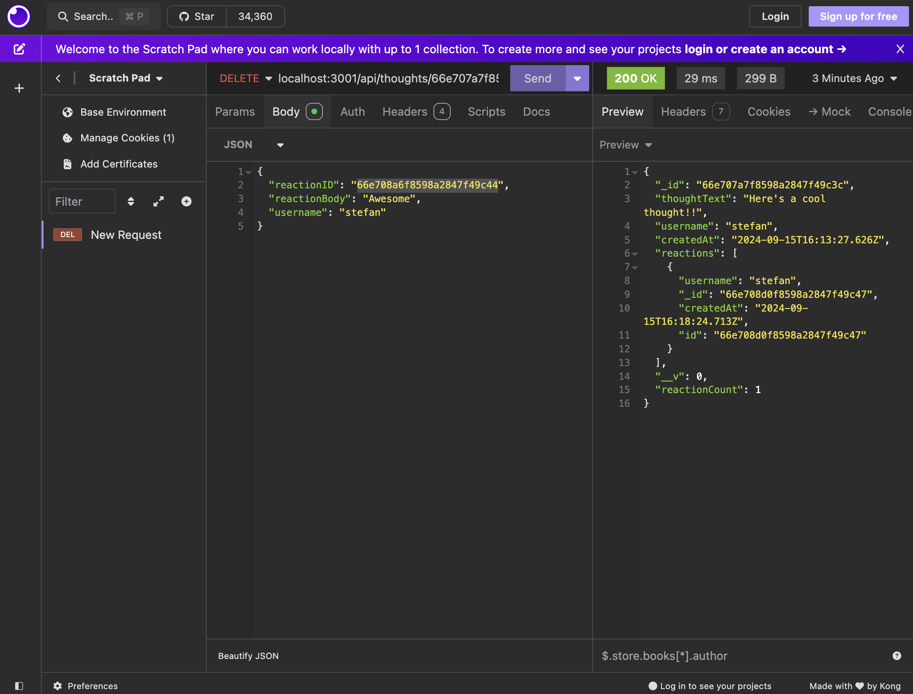

# Sunset Social Media
  
 
  ## table of contents 
  *  [Description](#description)
  *  [Installation](#installation)
  *  [Usage](#usage)
  *  [Questions](#questions)
  *  [License](#license)
    
  
## Description
My motivation to create this project was to create a social media backend project to track users, thoughts, and reactions. I built this project to create a streamlined way to access a dynamic social media backend. This application solves the problem of not having a social media backend service.

## Deployed Site

This project is run on the backend and is not deployed. Here is a link to a walkthough video: https://drive.google.com/file/d/13QTBZKeMmnDmE12ZcnX0J3xWwCm8wI_j/view?usp=sharing

## Installation

To install the project, pull the code frrom https://github.com/stefanfilm/sunsetsocialmedia and open it in a code editor. Run npm i to install the package json. Run npm start to use the application at local host 3000. Open Insomnia.

## Usage

Open Insomnia an run the routes in from the code. 


    ```md
    
    ```


  ## License
  This project is licensed with the MIT license.
  

  ## Contributions
  Self. This project was made under the instruction of Mark Carlson in the UC Berkeley Software Development Bootcamp.

  ## Questions
  You can contact me at stefan.wanigatunga@gmail.com
  My GitHub Username is stefanfilm